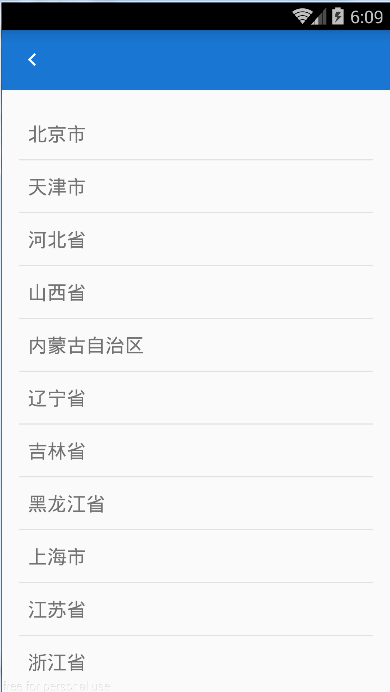

# ChooseAddressExample
一个仿微信的简单的地址选择器。

1.启动 ChooserActivity，第二个参数传 null
```JAVA
    ChooserActivity.start(MainActivity.this, null);
```
2.注册广播，接收选择结果
```JAVA
    ...
    private BroadcastReceiver echoRegionReceiver = new BroadcastReceiver() {
        @Override
        public void onReceive(Context context, Intent intent) {
            if (intent.getAction().equals(ChooserActivity.ACTION)) {
                String region = intent.getStringExtra(ChooserActivity.ART_ADDRESS);
                tvEchoRegion.setText(region);
                setSaveTextButtonEnable();
            }
        }
    };
    
      @Override
    protected void onCreate(Bundle savedInstanceState) {
        IntentFilter intentFilter = new IntentFilter();
        intentFilter.addAction(ChooserActivity.ACTION);

        registerReceiver(echoRegionReceiver, intentFilter);
    }
```

 
